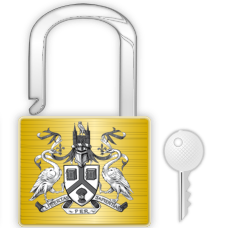
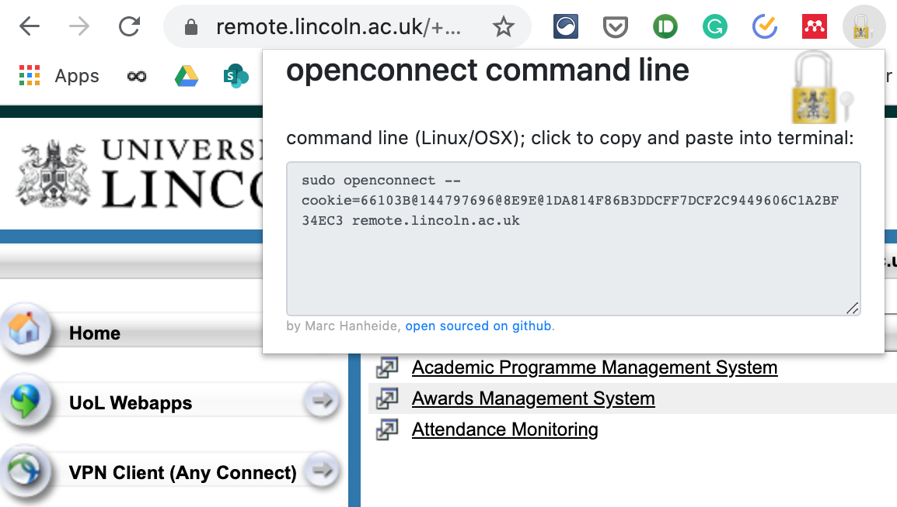

# OpenAnyconnect Cookie Tray (Uni Lincoln)


This simple extension is designed to work the University of Lincoln's AnyConnect Portal of a Cisco VPN installation. All it does it to extract the VPN cookie from it to generate a command line for openconnect to be used on Linux of OSX. It's open source and available from https://github.com/marc-hanheide/openconnect_cookie_extractor to be customised also for other portals.

## Usage

Simple! 

1. Install the extension 
    * in webstore soon (hopefully)
    * for now download `.crx` file from [releases](https://github.com/marc-hanheide/openconnect_cookie_extractor/releases), enable developer mode in chrome://extensions/ and drag the downloaded `.crx` file into the window to install. If that fails, use [setup for development](#setup-for-development) for now.
1. navigate to https://remote.lincoln.ac.uk 
1. log in (with MFA if needed)
1. click on the extension icon to display the command line for open connect with the secret auth cookies put already in place
1. go to the terminal and paste the command line
1. Enjoy VPN!

## setup for development
* ```$ git clone https://github.com/marc-hanheide/openconnect_cookie_extractor.git```
* open your chrome and open the url ```chrome://extensions/```
* load unpacked extension where you just cloned（note:open your dev mode）

## screenshot



### thx

forked from https://github.com/billyct/cookies_json_chrome_extension (thanks to [billyct](https://github.com/billyct)) and adapted for our special use case.
